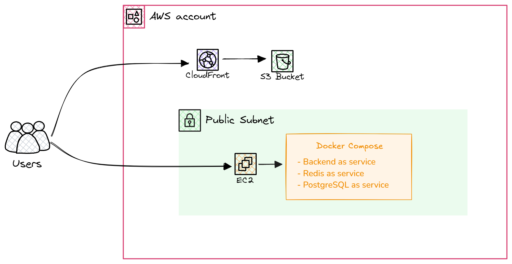

# EC2-Cloudfront-S3-Deploy
This pipeline deploys Cloudfront cache and S3 bucket for storing frontend also VPC, security group,
IAM instance profile and EC2 instance for running backend containers. Containers are stored in
the private ECR, and running using Docker Compose.
For automation used terraform code running on GitHub Actions.


## Technologies Used:

#### * _AWS Cloud_
#### * _Docker/Docker-Compose_
#### * _Terraform_
#### * _GitHub Actions_

## Requirements to deploy the Project
#### - AWS Account
#### - Github Account

## Infrastructure diagram




## Project Overview

#### Frontend Deployment
A webpage and config.json hosted on S3, delivered via CloudFront for low-latency content delivery and caching.

#### Backend Deployment
Containerized backend services and databases using Docker Compose. Deployed on EC2 instance within a custom VPC.
Secured with security group for least privileges access control. Backend code and CI workflow stored in this repo: `https://github.com/vladskvortsov/mind-project1-2`.

#### Networking
Configured custom VPC, public subnets, NAT gateways, and route tables.

#### CI/CD Pipeline
Terraform configurations are stored in the repository.
GitHub Actions automate the deployment and management of the infrastructure.


## Setup steps
Step 1: Fork the Repository 

Step 2: Configure GitHub Secrets

Add the following secrets to your GitHub repository:

```sh
AWS_ACCESS_KEY_ID: `IAM access key for AWS API operations.`
AWS_SECRET_ACCESS_KEY: `Secret key paired with the access key.`
AWS_REGION: `The AWS region where resources will be created (e.g., us-east-1).`
```

Step 3: Run the `Deploy Project` workflow to deploy the project
> Note: Feel free to use `Deploy Frontend` or `Deploy Backend` workflows if required. Also, you can use the `Delete Resources` workflow to remove whole infrastructure including S3 bucket for Terraform's backend.

Step 4: Access the Deployed Application

Copy the CloudFront URL from GitHub Actions output, and open the webpage in your browser.

> Note: Use `http://` connection for this project.

## Key Notes:
> Resource Costs: Ensure you understand AWS pricing to manage project costs effectively.

> Security: Use least privilege access for AWS credentials. `Don't paste AWS credentials anywhere excluding GitHub Secrets`

> Debugging: You can monitor the infrastructure deploying in GitHub Actions logs, and find out errors if present.

> Documentation: Don't forget to update the repository's `README.md` to reflect current workflows and configurations.